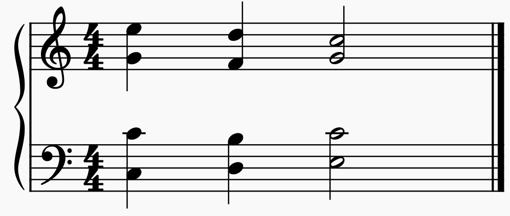

# Diminished Fifth Resolutions
A diminished fifth (a tritone) should not resolve to a perfect fifth

## Description
Moving from a P5 to a d5 is allowed. This is called "unequal fifths". This motion however can often be confused with moving the other direction. Having a tritone often implies a specific resolution. The two notes of the tritone are typically a dominant 7th (which should resolve downwards) and the leading tone (which should move upwards). Moving from d5 to P5 will not fit that resolution.

## Example

In the example above, the spacing in the middle chord between the alto and the tenor is a diminished fifth. These then move to a perfect fifth in the last chord. In this case, the `F` in the alto should have resolved to an `E` since it was the dominant 7th of the chord.
