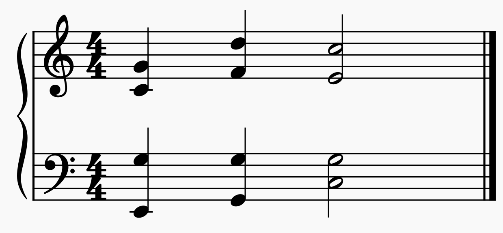

# Hidden Fifths
Hidden fifths occur when similar motion between the soprano and another voice moves the voices to a perfect unison, fifth or octave. Additionally, the soprano voice moves by a leap, and not be a step.

# Description
Hidden fifths are a fairly specific case and all of the following conditions
- Similar motion between soprano and another voice.
- The soprano and the other voice move to a perfect unison, fifth or octave.
- Soprano moves by a leap.

The reason this is bad is because this type of motion implies parallel fifths (or octaves).

# Example

The above example has hidden fifths occurring bettwen the first two beats of the bass and the soprano. Note that the two parts are moving in similar motion, and that they end with the bass on `G` and the Soprano on `D`. Since the soprano moved by a leap here, there are hidden fifths.
