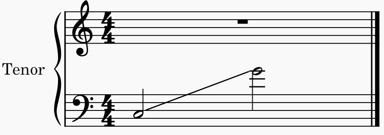

# Range Errors
A range error occurs when one individual part exceeds the range normally given to that part. For example, A bass vocalist is not likely going to be able to sing something above the treble clef.

## Example


In the example above, the last note of the bass part is lower than the standard range for bass part-writing.

## Default Configuration
Soprano: C4 to G5<br>

---------------------------------------

Alto: G3 to C5<br>

---------------------------------------

Tenor: C3 to G4<br>

---------------------------------------

Bass: E2 to C4<br>


## Changing the Configuration
Updating the configuration for range errors requires editing the source code to indicate the new ranges. Changing any of the numerical values in this code block will update the range for that specific voice. This is all done where `60` represents `C4`.
```qml
// Allowed Part Range Configurations
property int sopranoHighestNote  :   79      // G5
property int sopranoLowestNote   :   60      // C4
property int altoHighestNote     :   72      // C5
property int altoLowestNote      :   55      // G3
property int tenorHighestNote    :   67      // G4
property int tenorLowestNote     :   48      // C3
property int bassHighestNote     :   60      // C4
property int bassLowestNote      :   40      // E2
```

Example:<br>
To change the range for the lowest bass note to `C2`, change the line<br>
`property int bassLowestNote      :   40      // E2`<br>
to<br>
`property int bassLowestNote      :   36      // C2`