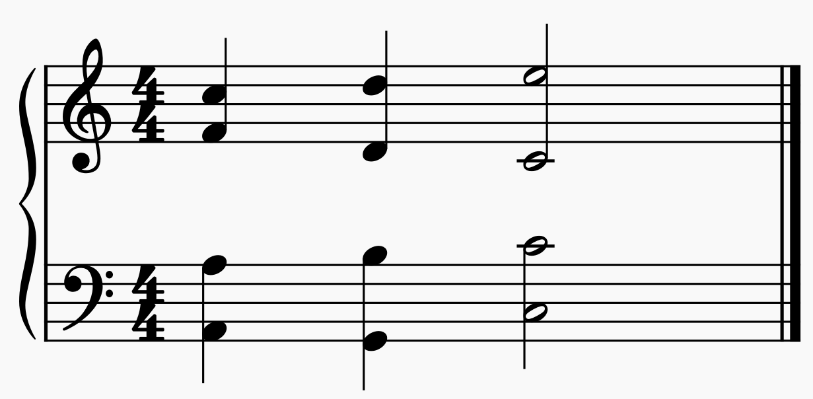

# Spacing Errors
Spacing Errors occur when two parts are spread too far apart. 

## Example


For Example, in the image above, the spacing between the soprano and the alto is greater than an octave, thus a spacing error has occurred.

## Default Configuration
- Soprano - Alto: Perfect Octave
- Alto - Tenor: Perfect Octave
- Tenor - Bass: Perfect 15va (2 Octaves)

## Changing the Configuration
Updating the configuration for spacing errors requires editing the source code to indicate the new ranges. Changing any of the numerical values in this code block will update the allowed spacing for those specific voices. The number input represents the number of half-steps allowed. For example, a Perfect octave is 12 half-steps, thus the value for that would be 12.
```qml
// Maximum Spacing Configuration
property int sopranoAltoMaxDistance     :   12  // P8
property int altoTenorMaxDistance       :   12  // P8
property int tenorBassMaxDistance       :   24  // P15
```

Example:<br>
To change the spacing allowed between the tenor and the bass to a major 10th, change the line<br>
`property int tenorBassMaxDistance       :   24  // P15`<br>
to<br>
`property int tenorBassMaxDistance       :   16  // M10`
