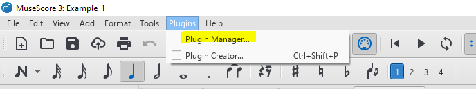
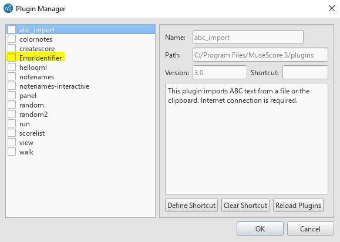
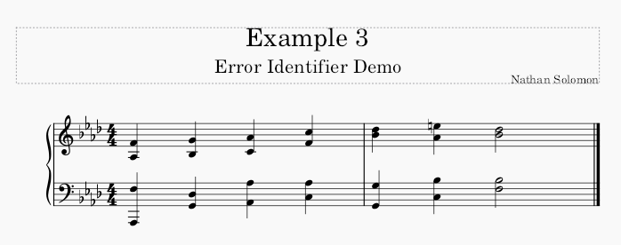
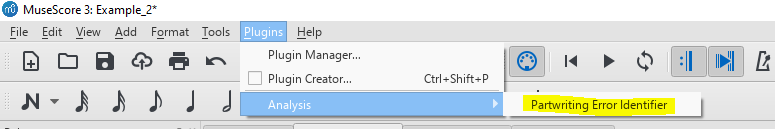

# Running

## Overview
To run the plugin, open musescore and  then select the plugins manager from the plugins menu. If the plugin was installed correctly (see [installation](#installation)) you should see this plugin identified in that list. Selecting the checkbox by the plugin will make the plugin available for use.

## Enabling the Plugin
To enable the plugin, first open the Musescore Plugin Manager: 

Once in the Musescore Plugin Manager, there should be an option labeled "Error Checker". 

If there is no "Error Checker" option available, try selecting "Reload Plugins". If there is still no option available, return to [installation](#installation) to verify that the plugin was installed correctly.

Next, selected the "Error Checker" option then click "OK" 

## Running the Plugin
Running the plugin is fairly simple. First, input your partwriting in Musescore. For Example: 

Next, Select the Parwriting Error Identifier from the Analysis Subcategory of the Plugins menu. 

This will generate a report outlining the errors that were found in your partwriting. Additionally, the notes of your score will be colored to indicate where the specific errors are.

When you are done, you can either clear the colors, or select "OK" to exit the report. If you leave the colors and want to remove them later, you can simply rerun the plugin and select "Remove Colors" at that time.
